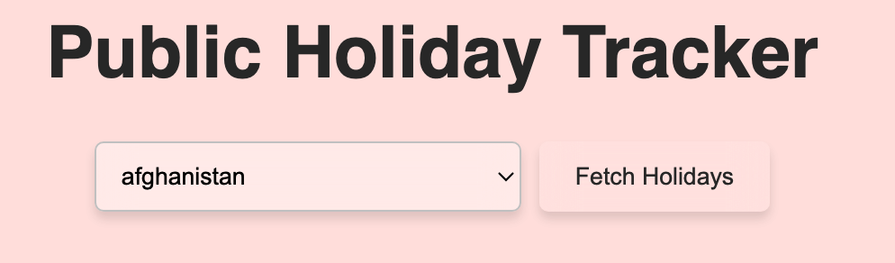
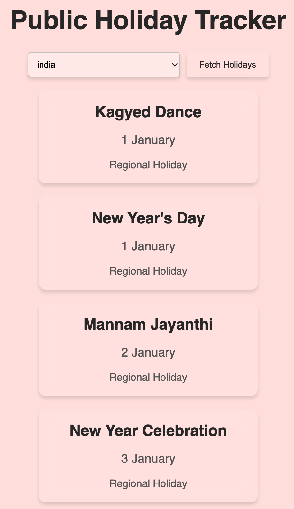
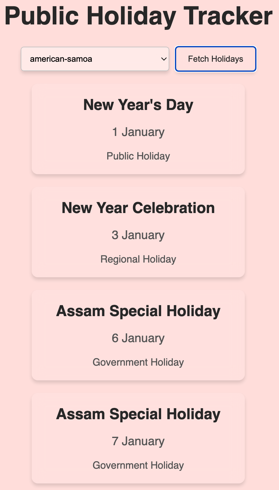

# XPublic Holidays

**XPublic Holidays** is a web application that provides users with up-to-date information about public holidays worldwide. It offers a simple and intuitive interface for checking public holidays by country, year, and region, making it a valuable tool for planning and scheduling.

## Table of Contents📚

1. [Introduction🚀](#introduction)
2. [Features🛠️](#features)
3. [Screenshot📷](#screenshot)
4. [Getting Started🎯](#getting-started)
5. [Prerequisites📋](#prerequisites)
6. [Installation⚙️](#installation)
7. [Usage📈](#usage)
8. [Contributing❤️](#contributing)
9. [License📝](#license)

## Introduction🚀

**XPublic Holidays** provides a comprehensive database of public holidays for various countries and regions. Users can easily search for holidays by year, country, and region to help plan their schedules and activities. The application is designed to be both user-friendly and informative.

## Features🛠️

- **Holiday Search:** Search for public holidays by country, year, and region.
- **Detailed Information:** Get detailed information about each public holiday, including its date and significance.
- **Global Coverage:** Access information about public holidays from around the world.
- **User-Friendly Interface:** Intuitive design for easy navigation and search.
- **API Integration:** Option to integrate with external APIs for up-to-date holiday data (optional).

## Screenshot📷






## Getting Started🎯

To get started with **XPublic Holidays**, follow these steps:

1. Clone the repository to your local machine.
2. Install the necessary dependencies.
3. Configure your environment settings.
4. Start the application and explore public holiday data.

## Prerequisites📋

- Node.js (version 14 or higher)
- npm or yarn
- A modern web browser

## Installation⚙️

1. Clone the repository:
   ```bash
   git clone https://github.com/BoddepallyVenkatesh06/Buildout_XPublic_Holidays.git
   ```

2. Navigate to the project directory:
   ```bash
   cd xpublic-holidays
   ```

3. Install dependencies:
   ```bash
   npm install
   ```
   or
   ```bash
   yarn install
   ```

4. Configure environment settings (create a `.env` file based on `.env.example`).

5. Start the application:
   ```bash
   npm start
   ```
   or
   ```bash
   yarn start
   ```

## Usage📈

Once the application is running, you can:

- Search for public holidays by entering the country, year, and region.
- View detailed information about each public holiday.
- Navigate through the user-friendly interface to find relevant holiday data.

## Contributing❤️

Contributions to **XPublic Holidays** are welcome! To contribute:

1. Fork the repository.
2. Create a new branch for your changes.
3. Make modifications and commit with clear messages.
4. Push your changes to your forked repository.
5. Submit a pull request with a detailed description of your changes.

## License📝

MIT License

Copyright (c) 2024 Venky Kumar

Permission is hereby granted, free of charge, to any person obtaining a copy
of this software and associated documentation files (the "Software"), to deal
in the Software without restriction, including without limitation the rights
to use, copy, modify, merge, publish, distribute, sublicense, and/or sell
copies of the Software, and to permit persons to whom the Software is
furnished to do so, subject to the following conditions:

The above copyright notice and this permission notice shall be included in all
copies or substantial portions of the Software.

THE SOFTWARE IS PROVIDED "AS IS", WITHOUT WARRANTY OF ANY KIND, EXPRESS OR
IMPLIED, INCLUDING BUT NOT LIMITED TO THE WARRANTIES OF MERCHANTABILITY,
FITNESS FOR A PARTICULAR PURPOSE AND NONINFRINGEMENT. IN NO EVENT SHALL THE
AUTHORS OR COPYRIGHT HOLDERS BE LIABLE FOR ANY CLAIM, DAMAGES OR OTHER
LIABILITY, WHETHER IN AN ACTION OF CONTRACT, TORT OR OTHERWISE, ARISING FROM,
OUT OF OR IN CONNECTION WITH THE SOFTWARE OR THE USE OR OTHER DEALINGS IN THE
SOFTWARE.